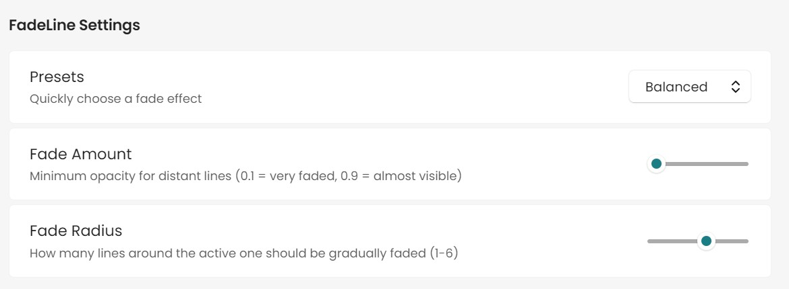

# FadeLine

Clarity in the chaos. FadeLine dims the noise so your thoughts can speak. Made for Obsidian.

  

## Features

- **Gradual fade:** The further a line is from your cursor, the more faded it becomes.
- **Active line always clear:** The current line is always fully visible, even when not editing.
- **Smart auto-scroll:** Automatically centers the current line in the editor for optimal focus.
- **Fade toggle:** Option to disable fade effects completely for clean text mode.
- **Customizable:**
  - **Enable/Disable fade:** Toggle fade effects on/off with a single click
  - **Fade amount:** Set the minimum opacity for the most distant lines (slider)
  - **Fade radius:** Choose how many lines around the cursor are faded gradually (slider)
  - **Auto-scroll delay:** Control how quickly the editor scrolls to center the current line
  - **Scroll smoothness:** Adjust the animation smoothness for a natural feel
  - **Presets:** Quick presets for different focus styles and use cases
- **Live preview:** See exactly how your settings will look in the settings tab.
- **Click detection:** Automatically updates focus when clicking on different lines.

## Use Case Presets

### **Focus Mode (Default)**
- **Fade:** Balanced (0.1 fade, radius 4)
- **Auto-scroll:** Instant (0ms delay, 0.1 smoothness)
- **Perfect for:** Maximum focus with instant response

### **Writing Mode**
- **Fade:** Sharp focus (0.1 fade, radius 4)
- **Auto-scroll:** Responsive (200ms delay, 0.3 smoothness)
- **Perfect for:** Active writing and content creation

### **Reading Mode**
- **Fade:** Gentle focus (0.3 fade, radius 3)
- **Auto-scroll:** Relaxed (800ms delay, 0.5 smoothness)
- **Perfect for:** Comfortable reading and review

### **Coding Mode**
- **Fade:** Ultra sharp (0.05 fade, radius 6)
- **Auto-scroll:** Fast (150ms delay, 0.2 smoothness)
- **Perfect for:** Code editing and programming

### **Presentation Mode**
- **Fade:** Moderate (0.2 fade, radius 2)
- **Auto-scroll:** Slow (1200ms delay, 0.7 smoothness)
- **Perfect for:** Presentations and demonstrations

### **Minimal Mode**
- **Fade:** Subtle (0.6 fade, radius 2)
- **Auto-scroll:** Disabled
- **Perfect for:** Minimal visual interference

### **No Fade Mode** ⭐
- **Fade:** Disabled (clean text mode)
- **Auto-scroll:** Responsive (200ms delay, 0.3 smoothness)
- **Perfect for:** Users who prefer clean text without fade effects

## Auto-Scroll Presets

- **Instant:** Immediate scroll with no delay (0ms delay, 0.1 smoothness)
- **Responsive:** Quick response for active writing (100ms delay, 0.2 smoothness)
- **Smooth:** Balanced delay with smooth animation (300ms delay, 0.4 smoothness)
- **Relaxed:** Gentle scroll for reading and editing (600ms delay, 0.6 smoothness)
- **Presentation:** Slow, deliberate scroll for presentations (1000ms delay, 0.8 smoothness)
- **Disabled:** Auto-scroll turned off

## Fade Presets

- **Gentle:** Subtle fade effect (0.4 fade, radius 2)
- **Balanced:** Perfect equilibrium (0.1 fade, radius 4)
- **Strong:** Intense focus (0.2 fade, radius 6)
- **Ultra Focus:** Maximum concentration (0.05 fade, radius 6)

## Installation
1. Download `main.js`, `manifest.json`, and `styles.css` into a folder named `FadeLine` inside your Obsidian plugins directory.
2. (Optional) Add `main.ts` if you want to inspect or modify the source code.
3. Enable FadeLine from Obsidian Settings → Community plugins.
4. Choose your preferred preset or customize settings as you like!

## How It Works

FadeLine enhances your focus by:
1. **Detecting your cursor position** in real-time
2. **Fading distant lines** based on your settings (when fade is enabled)
3. **Keeping the current line crystal clear** for maximum readability
4. **Automatically scrolling** to center the active line when needed
5. **Responding to clicks and cursor movements** for seamless interaction
6. **Providing fade toggle** - you can disable fade effects completely for clean text mode

The plugin uses intelligent algorithms to provide smooth transitions and optimal performance, ensuring your writing flow remains uninterrupted. When fade effects are disabled, all lines maintain full opacity for a clean, distraction-free experience.

## Author
**FadeLine** is created by **[Vlad 3Design](https://github.com/Vlad3Design)**

A focus-enhancing Obsidian plugin designed to help you concentrate on your current line while maintaining context of surrounding content. Perfect for writers, developers, students, and anyone who values deep focus.

## License
MIT 
