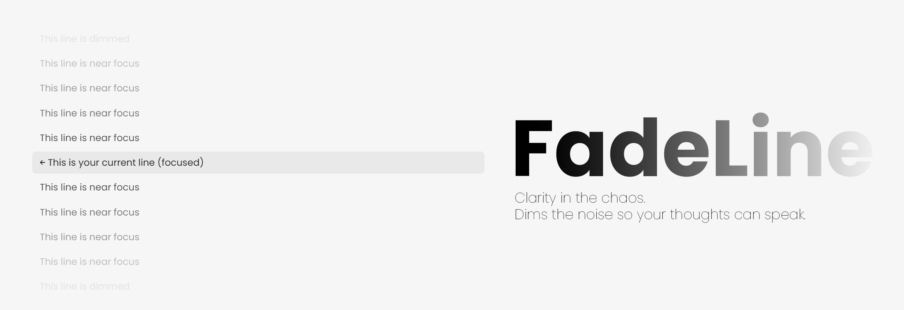

# FadeLine

Clarity in the chaos. FadeLine dims the noise so your thoughts can speak.

## Features
- **Gradual fade:** The further a line is from your cursor, the more faded it becomes.
- **Active line always clear:** The current line is always fully visible, even when not editing.
- **Customizable:**
  - **Fade amount:** Set the minimum opacity for the most distant lines (slider)
  - **Fade radius:** Choose how many lines around the cursor are faded gradually (slider)
  - **Presets:** Quick presets for different focus styles (Gentle, Balanced, Strong, Ultra Focus)
- **Live preview:** See exactly how your settings will look in the settings tab.

## Presets
- **Gentle:** fade amount 0.4, radius 2
- **Balanced (default):** fade amount 0.1, radius 4
- **Strong:** fade amount 0.2, radius 6
- **Ultra Focus:** fade amount 0.05, radius 6

## Installation
1. Download `main.js`, `manifest.json`, and `styles.css` into a folder named `FadeLine` inside your Obsidian plugins directory.
2. (Optional) Add `main.ts` if you want to inspect or modify the source code.
3. Enable FadeLine from Obsidian Settings → Community plugins.
4. Adjust fade settings and presets as you like!

## Author
**FadeLine** is created by **[Vlad 3Design](https://github.com/Vlad3Design)**

A focus-enhancing Obsidian plugin designed to help you concentrate on your current line while maintaining context of surrounding content.

## License
MIT 